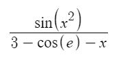
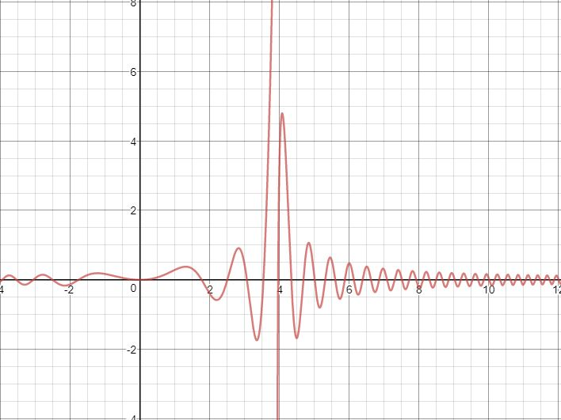
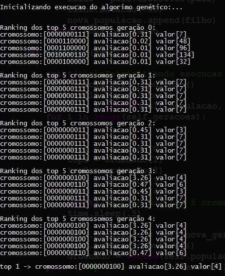

# O Algoritmo Genético mais básico

Este GA apenas testa as heurísticas evolucionárias para maximizar a função abaixo:

O gráfico para esta função já é previamente conhecido, além disso as soluções possíveis
afim de simplificação, são todos os números naturais que podem ser representados por 10 bits,
ou seja, de 0 até 1023, note que esta não é uma situação ideal de aplicação para o GA, visto
que o espaço de soluções é demasiadamente pequeno, o que em um cenário real poderia ser tratado
de uma maneira mais simples, todavia, segue o gráfico da função:

Como o gráfico mostra, a função possuí uma assíntota vertical próxima ao valor 4, portanto,
espera-se que a maximização da função através do GA faça com que o melhor cromossomo seja aquele
que representa valores próximos de 4 ou o próprio 4, e é exatamente o comportamento observado
com o passar das gerações (o teste foi realizado com uma população de 40 cromossomos e 5 gerações):

